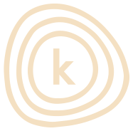

# Como Escrever um CHANGELOG para Seu Projeto de Desenvolvimento

Quando se trata de desenvolver software, manter um registro claro das mudanças é essencial para garantir uma comunicação eficaz entre os membros da equipe, além de fornecer transparência para os usuários finais. Um arquivo CHANGELOG bem escrito é uma ferramenta valiosa para acompanhar o progresso do projeto e informar os usuários sobre as atualizações mais recentes.



## O que é um CHANGELOG?

Um CHANGELOG é um documento que registra todas as alterações notáveis feitas em um projeto de software desde o seu início. Ele fornece uma visão geral das versões lançadas, juntamente com uma descrição das mudanças introduzidas em cada versão. Isso inclui novas funcionalidades, correções de bugs, melhorias de desempenho e outras alterações relevantes.

## Como Nomear as Versões

Ao nomear as versões em um CHANGELOG, é comum seguir a convenção de versionamento semântico. Esta convenção consiste em três números separados por pontos: X.Y.Z. Onde:

- **X** representa a versão principal. É incrementado quando há mudanças significativas que podem afetar a compatibilidade com versões anteriores ou introduzir grandes novas funcionalidades.
- **Y** representa a versão secundária. É incrementado para adicionar novas funcionalidades ou melhorias que são compatíveis com versões anteriores.
- **Z** representa a versão de correção. É incrementado para correções de bugs ou pequenas melhorias que não alteram a funcionalidade existente de forma significativa.

Por exemplo, a versão 1.2.3 indica a primeira versão principal, a segunda versão secundária e a terceira versão de correção.

## Opções de Tópicos

Existem várias opções de tópicos que você pode incluir em um CHANGELOG para documentar as mudanças em seu projeto. Aqui estão alguns exemplos comuns:

- **Added / Adicionado**: Liste novas funcionalidades ou recursos adicionados desde a última versão.
- **Changed / Alterado**: Registre alterações significativas feitas em funcionalidades existentes ou na estrutura do software.
- **Fixed / Corrigido**: Liste todos os problemas ou bugs corrigidos desde a última versão.
- **Removed / Removido**: Registre qualquer funcionalidade, componente ou recurso que tenha sido removido do software.
- **Security /  Segurança**: Se aplicável, liste quaisquer vulnerabilidades de segurança identificadas e corrigidas desde a última versão.

## Exemplo de um CHANGELOG

Aqui está um exemplo de como um CHANGELOG pode ser estruturado:

```
# CHANGELOG

## [1.0.0] - 2024-01-01

### Adicionado
- Funcionalidade de login.
- Página de perfil do usuário.

### Alterado
- Melhorias na interface do usuário.

### Corrigido
- Corrigido o bug que impedia o envio de mensagens.

## [0.2.0] - 2023-12-15

### Adicionado
- Funcionalidade de registro de usuário.

### Alterado
- Atualização da documentação do projeto.

## [0.1.0] - 2023-12-01

### Adicionado
- Configuração inicial do projeto.
```

Este é apenas um exemplo, e você pode personalizar seu CHANGELOG conforme necessário para atender às necessidades específicas do seu projeto.


[Exemplo de Changelog INICIAL ](CHANGELOG.md)

[Exemplo 2 de Changelog em .md](CHANGELOG2.md)

Com um CHANGELOG claro e bem organizado, você pode manter todos os membros da equipe informados sobre as mudanças no seu projeto e garantir uma experiência consistente para os usuários finais.

## Créditos
  👏[Josué Lobo](https://www.linkedin.com/in/jojosuelobo) e seu [canal](https://www.youtube.com/@jojosueloboYT) por compartilhar [conhecimentos](https://github.com/jojosuelobo) de forma simples e divertida🙏✨ e ao [Hugo](https://www.linkedin.com/in/thishugo/) por seus insights💡 em meu caminho de aprendizado
🌟📚🚀.# Guia_do_CHANGELOG
